   
  

  
  
  
  

🎓 Final-year Computer Engineering Technology student @ HCMUTE &nbsp;·&nbsp; 🔧 Embedded systems &amp; real-time control &nbsp;·&nbsp; 🌱 Learning Linux &amp; automotive-grade software practices

 

## 🧰 Tech Stack

  
  
  
  

  
  
  
  

  
  
  
  

 

## 📊 GitHub Stats

  
  

  

 

## 🐍 Contribution Snake

  <picture>
    <source media="(prefers-color-scheme: dark)" srcset="https://raw.githubusercontent.com/trtrung1209/trtrung1209/output/github-snake-dark.svg" />
    <source media="(prefers-color-scheme: light)" srcset="https://raw.githubusercontent.com/trtrung1209/trtrung1209/output/github-snake.svg" />
    
  </picture>

 

  

